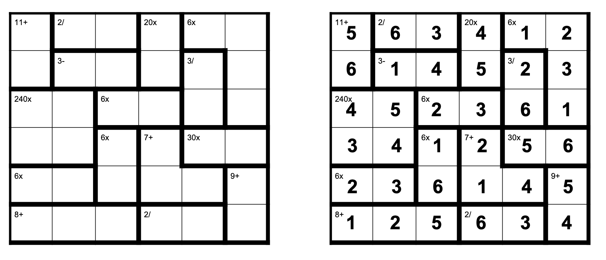

# sukodu

[](https://github.com/anthonytedja/sudoku)

> sudoku is an AI-powered sudoku variant solver.

## Introduction

There are two parts to this project:

- `propagators.py` : The implementation of two constraint propagators – a Forward Checking constraint propagator and a Generalized Arc Consistence (GAC) constraint propagator. Also includes the implementation of the MRV heuristic for selecting variables to be assigned to code in this file.
- `funpuzz_csp.py` : The encoding of three different CSP models to solve a logic puzzle that is a sudoku variant called FunPuzz, as described below. One model uses binary not-equal constraints for row and column constraints, while the other model uses n-ary all-different constraints for them. The third model encodes row, column and cage constraints (which are defined below).

## Funpuzz Formal Description

The Sudoku variation encoded is called FunPuzz and has the following formal description:

- The game consists of an n×n grid where each cell of the grid can be assigned a number 1 to n. No digit appears more than once in any row or column. Grids range in size from 3×3 to 9×9.
- The game grids are divided into heavily outlined groups of cells called cages. These cages come with a target and a mathematical operation. The numbers in the cells of each cage must produce the target value when combined using the mathematical operation.
- For any given cage, the operation can be one of addition, subtraction, multiplication or division. Values in a cage can be combined in any order: the first number in a cage may be used to divide the second, for example, or vice versa. Note that the four operators are “left associative” e.g., 16/4/4 is interpreted as (16/4)/4 = 1 rather than 16/(4/4) = 16.
- A puzzle is solved if all empty cells are filled in with an integer from 1 to n and all above constraints are satisfied.
- An example of a 6×6 grid is shown in the Figure. Note that your solution will be tested on n×n grids where n can be from 3 to 9.

## Setup & Usage

To run premade board tests, use the following command:

```cpp
python3 autograder.py
```

## Features

- Integrated Forward Checking and Generalized Arc Consistence constraint propagators with MRV heuristic to minimize search tree runtime by over 10000 times compared to Backtracking Search.
- Encoded efficient CSP models to exponentially outperform solution runtimes, variable assignments and prune value ratios.

## Built With

- Visual Studio Code
